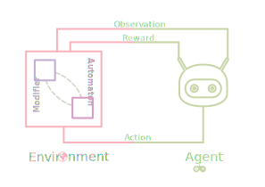
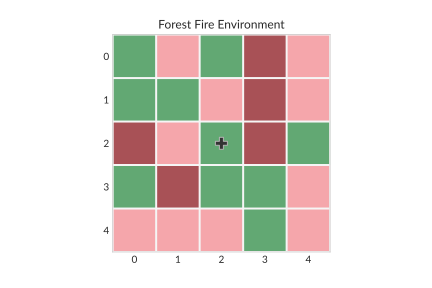

# Gym Cellular Automata
---

<p align="center">
    <a href="pics/gym_automata_diagram.svg"></a>
    <br />
    <br />
<<<<<<< HEAD
    <a href="https://semver.org/"></a>
=======
    <a href="https://semver.org/"></a>
>>>>>>> bulldozer
    <a href="http://choosealicense.com/licenses/mit/"></a>
    <a href="https://github.com/psf/black"></a>
    <br />
    <br />
    <h2 align="center">Cellular Automata Environments for Reinforcement Learning</h2>
</p>
<hr />

_Gym Cellular Automata_ is a collection of _Reinforcement Learning Environments_ (RLEs) that follow the [OpenAI Gym API](https://gym.openai.com/docs).

The available RLEs are based on [Cellular Automata](https://en.wikipedia.org/wiki/Cellular_automaton) (CAs). On them an _Agent_ interacts with a CA, by changing its cell states, in a attempt to drive the emergent properties of its grid to a desired configuration.

## Installation

```bash
git clone https://github.com/elbecerrasoto/gym-cellular-automata
pip install -e gym-cellular-automata
```

## Basic Usage

### Random Policy

```python
import gym

env = gym.make("gym_cellular_automata:forest-fire-v0")
obs = env.reset()

total_reward = 0.0
done = False

# Random Policy
for i in range(12):
    if not done:
        action = env.action_space.sample()
        obs, reward, done, info = env.step(action)
        total_reward += reward

print(f"Total Reward: {total_reward}")
```

### Available CA envs

```python
import gym_cellular_automata as gymca

# Print available CA envs
print(gymca.RESGISTERED_CA_ENVS)
```

## Gallery



## Documentation

:construction_worker: Documentation is in progress. 

## Contributing

Contributions to _Gym Cellular Automata_ are always welcome. Feel free to open _pull requests_ at will explaining your proposed change.

As the library is still on early development there is a dire need of everything! (_Utils, Docs, Envs, Tests ..._)

We aim to have a _zoo_ of Cellular Automata Environments. Thus of particular importance is adding more.

This project adheres to the following practices:

+ Worflow: [GitHub flow](https://guides.github.com/introduction/flow/)
+ Style: [Black](https://github.com/psf/black)
+ Test Suite: [Pytest](https://docs.pytest.org/en/stable/index.html)
