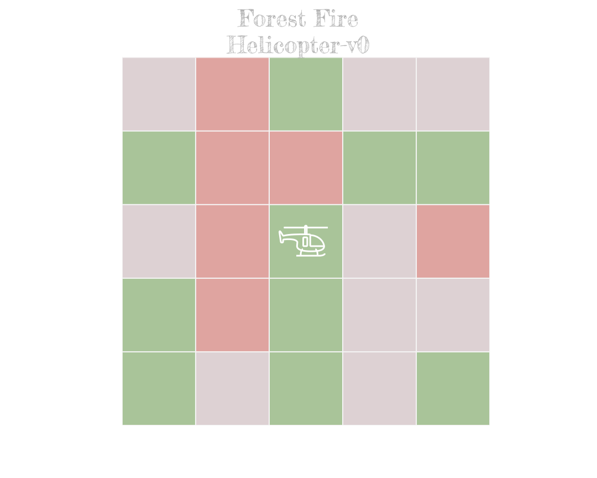
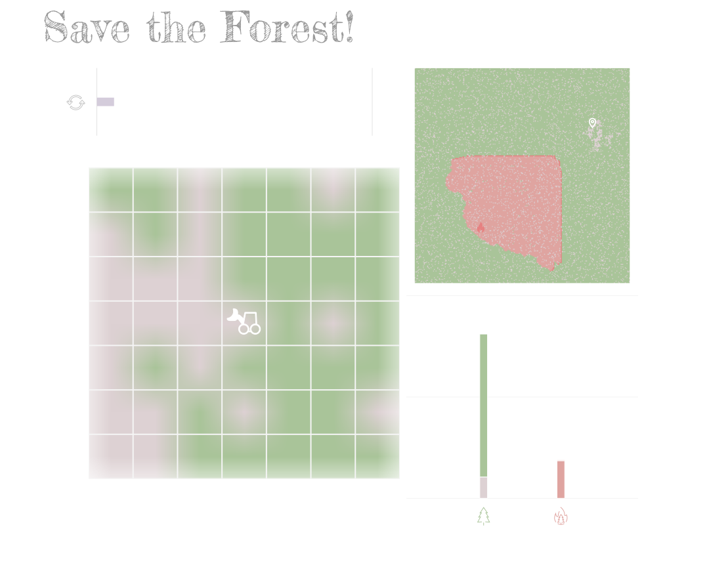

# Gym Cellular Automata
---

<p align="center">
    <a href="pics/gym_cellular_automata.svg"></a>
    <br />
    <br />
    <a href="https://semver.org/"></a>
    <a href="http://choosealicense.com/licenses/mit/"></a>
    <a href="https://github.com/psf/black"></a>
    <a href="https://gitmoji.dev"></a>
    <br />
    <br />
    <h2 align="center">Cellular Automata Environments for Reinforcement Learning</h2>
</p>
<hr />

_Gym Cellular Automata_ is a collection of _Reinforcement Learning Environments_ (RLEs) that follow the [OpenAI Gym API](https://gym.openai.com/docs).

The available RLEs are based on [Cellular Automata](https://en.wikipedia.org/wiki/Cellular_automaton) (CAs). On them an _Agent_ interacts with a CA, by changing its cell states, in a attempt to drive the emergent properties of its grid.

## Installation

```bash
git clone https://github.com/elbecerrasoto/gym-cellular-automata
pip install -e gym-cellular-automata
```

## Usage

:carousel_horse: :carousel_horse: :carousel_horse:

> Prototype & Benchmark, the two modes of _gymca_...

```python
import gymnasium as gym
import gym_cellular_automata as gymca

# benchmark mode
env_id = gymca.envs[0]
env = gym.make(env_id)

# prototype mode
ProtoEnv = gymca.prototypes[0]
env = ProtoEnv(nrows=42, ncols=42)
```

The tuple `gymca.envs` contains calling strings for `gym.make`.

`gym.make` generates an instance of a registered environment.

A registered environment is inflexible as it cannot be
customized. This is on purpose, since the _gym library_ is
about benchmarking _RL algorithms_—a benchmark must not change
if it wants to provide meaningful comparisons.

_CA Envs_ are experimental—they need to mature into worth-solving _RL tasks_. For this to happen fast prototyping is needed. This involves parameter tweaking and module combination.

_gym-cellular-automata_ strives to be an _environment-design_ library, this is the motivation behind the _prototype mode_, which does not register the environment, but exposes it to configuration.

Grid size (_nrows, ncols_) is one of the most changed parameters so it is required. Other parameters are optional and differ from class to class. Grid size is a _proxy_ for task difficulty, bigger grids are usually harder.

### Random Policy

```python
import gymnasium as gym
import gym_cellular_automata as gymca

env_id = gymca.envs[0]
gym.make(env_id)

obs = env.reset()

total_reward = 0.0
done = False
step = 0
threshold = 12

# Random Policy for at most "threshold" steps
while not done and step < threshold:
    action = env.action_space.sample()  # Your agent goes here!
    obs, reward, terminated, truncated, info = env.step(action)
    done = terminated or truncated
    total_reward += reward
    step += 1

print(f"{env_id}")
print(f"Total Steps: {step}")
print(f"Total Reward: {total_reward}")
```

## Gallery

### Helicopter ###



+ [Forest Fire Helicopter](./gym_cellular_automata/forest_fire/helicopter/README.md)

### Bulldozer ###



+ [Forest Fire Bulldozer](./gym_cellular_automata/forest_fire/bulldozer/README.md)

## Documentation

:construction_worker: Documentation is in progress.

+ [Forest Fire Environment Helicopter](./gym_cellular_automata/forest_fire/helicopter/README.md)
+ [Forest Fire Environment Bulldozer](./gym_cellular_automata/forest_fire/bulldozer/README.md)
+ [Architecture](./docs/architecture.md)

## Releases

:drum:
+ [`releases.md`](./releases.md)

## Contributing

:evergreen_tree: :fire:

For contributions check [contributing](./CONTRIBUTING.md) and [the to do list](todo.md).

Contributions to _Gym Cellular Automata_ are always welcome. Feel free to open _pull requests_.

This project adheres to the following practices:

+ Workflow: [GitHub flow](https://guides.github.com/introduction/flow/)
+ Style: [Black](https://github.com/psf/black)
+ Test Suite: [Pytest](https://docs.pytest.org/en/stable/index.html)

## Issues

+ [Known Issues](./issues.md)
